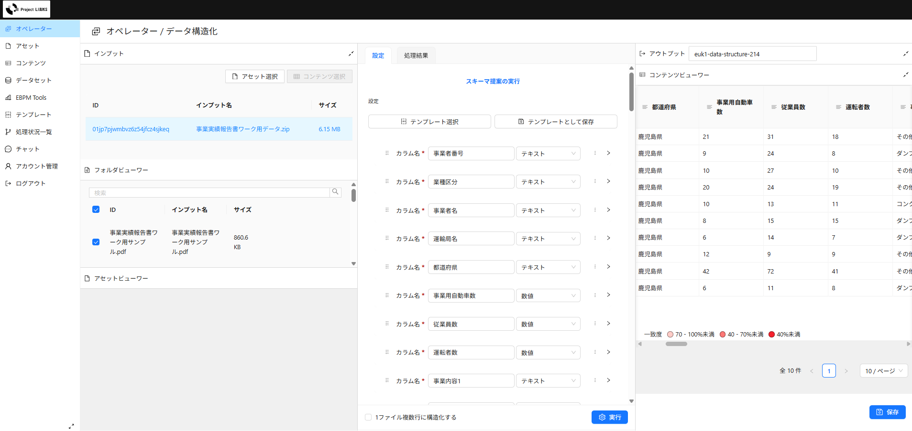
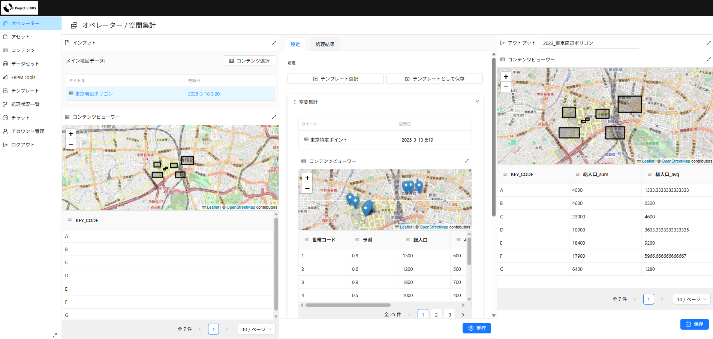

# LINKS Veda
## 0. 目次
- [0. 目次](#0-目次)
- [1. 概要](#1-概要)
- [2. 利用手順](#2-利用手順)
- [3. 主な機能](#3-主な機能)
- [4. 動作環境(推奨環境)](#4-動作環境推奨環境)
- [5. インストールとセットアップ](#5-インストールとセットアップ)
- [6. ディレクトリ構成](#6-ディレクトリ構成)
- [7. ライセンス](#7-ライセンス)
- [8. 注意事項](#8-注意事項)
- [9. お問い合わせ](#9-お問い合わせ)

## 1. 概要
国土交通省が推進する Project LINKSの一環として開発された「LINKS Veda」プロトタイプ版のソースコードを公開しています。  
本システムは、専門家でない一般ユーザーでも、これまで活用されてこなかった様々な行政情報を簡単にデータ化し、チャット機能や可視化アプリケーションを用いて活用可能とするWebアプリケーションです。

- **AI技術を活用したデータ構造化処理**
    
    LLM、OCR、自然言語処理（NLP）、ベクトルデータベースなどの技術を組み合わせ、紙やPDF、Wordファイル等の非構造データを機械処理可能な構造化データへと変換します。
    
- **ノーコードでのデータ生成・加工**
    
    データ生成・加工処理を概念化し、GUIベースで直感的に操作できる環境を提供。テンプレートとして保存・再利用することで、誰でも簡単にデータ構造化を繰り返し実行できます。




    
## 2. 利用手順
本システムの利用手順は、[操作マニュアル](https://www.mlit.go.jp/links/wp-content/uploads/links-veda-user-manual-v1.0.pdf)をご参照ください。

## 3. 主な機能
- **データ登録**
    - PDF、画像、テキストファイルなどの非構造データをWebインターフェースからシステムへアップロード。ユーザーによる簡便なデータ投入環境の提供。
- **データ構造化**
    - LLM、OCR、NLPを活用した情報抽出と、定義済みスキーマへのマッピングによる構造化処理。構造候補の提示を行うサジェスト処理と、変換処理による2段階構成。
- **データクレンジング**
    - 表記揺れの正規化、異常値の検出・除去、欠損値の補完による品質向上処理。システムによる自動処理と、ユーザーによる目視確認とのハイブリッド対応。
- **データ結合・データ集計**
    - 複数ソース由来の構造化データに対する統合・集計処理。テキストマッチング（類似文字列の同定）、クロス集計（複数の変数間の関係性の分析）、空間集計処理（地理情報の集約）などの分析支援手法を適用。
- **チャット利用**
    - 構造化済みデータのベクトル化および自然言語クエリに対する類似情報検索。検索結果の対話形式による提示機能の提供。
- **可視化アプリ利用**
    - 地図・グラフ等による視覚的表現を通じたデータの可視化。フィルタリングや条件指定、外部システム連携を想定した公開APIの提供。

## 4. 動作環境(推奨環境)
本システムは、国土交通省職員の省内での利用を想定しています。
- OS：Windows11 Enterprise
- CPU：AMD Ryzen（TM）3 5400U
- メモリ：32GB
- SSD：512GB
- ブラウザ：Microsoft Edge、Google Chrome

## 5. インストールとセットアップ
本システムは、Dockerを用いて開発環境を構築します。以下の手順に従って、開発環境をセットアップしてください。
1. **環境変数の設定**

   ```sh
   cp web/.env.example web/.env
   ```

   `.env`内の変数を必要に応じて更新してください。

2. **開発環境の起動**

   ```sh
   docker image prune -f
   docker compose up --build -d --remove-orphans
   ```
3. **データベースのマイグレーション**
   コンテナ内で以下のコマンドを実行してください。

   ```sh
   bun db:migrate-dev
   ```
4. **アプリケーションの起動**
   - アプリケーションは <http://localhost:3000/> で起動します。
   - Storybookは <http://localhost:6006/> で起動します。
   - Prisma Studioは <http://localhost:5555/> で起動します。
   - Firebase Emulatorは <http://localhost:4000/> で起動します。
5. **Linting**
   Biomeを使用してLintingを行います。詳細なインストール手順は[こちら](https://biomejs.dev/guides/manual-installation)をご覧ください。
6. **ビルド**
   - 開発環境ではHono Vite dev serverを使用しています。
   - 本番環境では、`server/build.ts`が`build/server/index.js`にバンドルされます。
   - Dockerデプロイ時には、`build`フォルダと`node_modules`をコピーします。
7. **データフローアーキテクチャ**
   ```
   UI -> loaders/actions -> services -> repositories
   ```
   - UIレイヤー（コンポーネント）
       - Atomic Designに基づいてコンポーネントを構成
       - ページはmoleculesとatomsを組み合わせて構成
       - ユーザーインタラクションと状態管理を担当
   - データハンドリングレイヤー（Loaders & Actions）
       - **Loaders** (`app/loaders/*`)
           - サーバーサイドで実行され、ルートのデータを取得
           - シリアライズ可能なデータを返す
           - ナビゲーション時に自動的に再検証
           - [Loader Documentation](https://remix.run/docs/en/main/route/loader)
       - **Actions** (`app/actions/*`)
           - フォーム送信を処理
           - POST/PUT/PATCH/DELETEリクエストを処理
           - データ検証を実施
           - レスポンスまたはリダイレクトを返す
           - [Action Documentation](https://remix.run/docs/en/main/route/action)
   - ビジネスロジックレイヤー（Services）
       - ビジネスルールを実装
       - 複数のリポジトリ呼び出しを調整
       - データ変換を処理
       - ビジネス制約を確保
   - データアクセスレイヤー（Repositories）
       - データベース操作を処理
       - API呼び出しを実装
       - ストレージの詳細を抽象化
       - データアクセスパターンを提供
   - ルーティング
       - `app/routes/*`にルートを定義
       - ルートはページコンポーネントをインポートしてレンダリング
       - Remixのルーティング規約に従う

## 6. ディレクトリ構成
```
app/
├── components/    # UIコンポーネント（Atomic Designに基づく）
│   ├── atoms/     # 基本UI要素（Button, Input, Selectなど）
│   ├── molecules/ # 複合コンポーネント
│   │   ├── Asset/      # アセット関連コンポーネント
│   │   ├── Content/    # コンテンツ管理コンポーネント
│   │   ├── Common/     # 共有複合コンポーネント
│   │   ├── Schema/     # スキーマ管理コンポーネント 
│   │   └── ...
│   └── pages/     # ページコンポーネント
│       ├── Assets/　# アセット関連コンポーネント
│       ├── Dashboard/ # ダッシュボード関連コンポーネント
│       ├── Operators/ # オペレーター関連コンポーネント
│       └── Schemas/ # スキーマ管理コンポーネント 
├── routes/        # ルートコンポーネントとレイアウト
├── actions/       # フォーム送信とデータ変更
├── loaders/       # ルートのデータ読み込み
├── services/      # ビジネスロジック層
├── repositories/  # データアクセス層
├── models/        # ドメインモデルと型
├── styles/        # CSSとスタイリングファイル
└── utils/         # ユーティリティ関数
```

## 7. ライセンス
ソースコード及び関連ドキュメントの著作権は国土交通省に帰属します。 本ソースコードはMITライセンス、本ドキュメントはProject LINKSサイトポリシー（CCBY4.0及び政府標準利用規約2.0）に従い提供されています。

## 8. 注意事項
- **個人情報保護**
    
    本システムでは個人情報を取り扱う場合があります。必ず自治体のセキュリティポリシーや関連法令を遵守し、適切な管理を行ってください。
    
- 動作保証
    
    本システムは Windows 10 / 11 環境での動作を想定しており、仮想環境やリモートデスクトップ環境などでは動作を保証していません。
    
- 免責事項
    
    本システムの利用や利用不能から生じるいかなる損害に対しても、開発者および国土交通省は一切の責任を負いません。

## 9. お問い合わせ
バグ報告や質問、機能要望などがございましたら、Issues へ起票いただくか、以下の連絡先までご連絡ください。

- 本システムのアプリケーションの活用にあたってのご相談
    
    株式会社ユーカリヤ([info@eukarya.io](mailto:info@eukarya.io))
    
- 本システムの AI技術についてのご相談
    
    マイクロベース株式会社([contact@microgeo.biz](mailto:contact@microgeo.biz))
